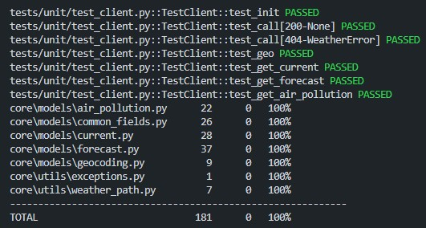

# PYWEATHER

Wrapper for the free tier of [OpenWeatherMap API](https://openweathermap.org/)

## Installation

If you feel like the project needs something more, feel free to pull and dev ! Here's how to (but i guess you already know how to do) !

```bash
C:/Users/you> git clone https://www.github.com/jordan95v/pyweather.git
C:/Users/you> cd pyweather
C:/Users/you/pyweather> py -m venv venv
C:/Users/you/pyweather> venv/Scripts/activate # venv\bin\activate on Mac
(venv) C:/Users/you/pyweather> pip install -r requirements.txt -r requirements-dev.txt
```

And you're set to go !

## Coverage

Here is the `pytest` code coverage:



## Workflow

### Get the current weather for a given city

The package can be used either with context manager:

```python
import asyncio
from core import Client
from core.models import Current


async def main():
    async with Client(app_id="...") as client: # Context manager
        res: Current = await client.get_current("FR", "75001")
        print(res)


if __name__ == "__main__":
    asyncio.run(main())
```

Or with a more classic approach:
```python
import asyncio
from core import Client
from core.models import Current


async def main():
    client: Client = Client(app_id="...")
    res: Current = await client.get_current("FR", "75001")
    print(res)
    await client.close() # Really important, do not forget to call the close method if you use it that way :)


if __name__ == "__main__":
    asyncio.run(main())
```

For the rest, method a quite auto-descriptive, this wrapper only cover the free tier, and it use the Geocoding API under the hood, so it only covers:
- current weather
- forecast weather
- air pollution

Each of the have a method and a model. The model is the EXACT representation of what returns the API, except that i do parse timestamp into actual datetime object (thanks pydantic).